# Dumpy
This repo describes some useful patterns and tips in GraphVIZ for creating graphical dumps.
# GraphVIZ
Graphviz is open source graph visualization software. It can be used for creating graphs from text file with special description. See more details on https://graphviz.org.

First steps and basic ideas can be found here: http://lib.custis.ru/Graphviz.

**Most of the attributes are described very briefly or not mentioned because they are easy to find in official documentation. But some patterns are not explicitly described on official site, nor on side sources. That's why that reference was created.**
___
___
## Attributes
###  ***Quality of image***
First of all, quality of **.png** can be very poor. Use **`dpi`** attribute (Dots Per Inch) or **.svg** format (vector graphics) instead of **.png**.

Examples:

dpi = 100:

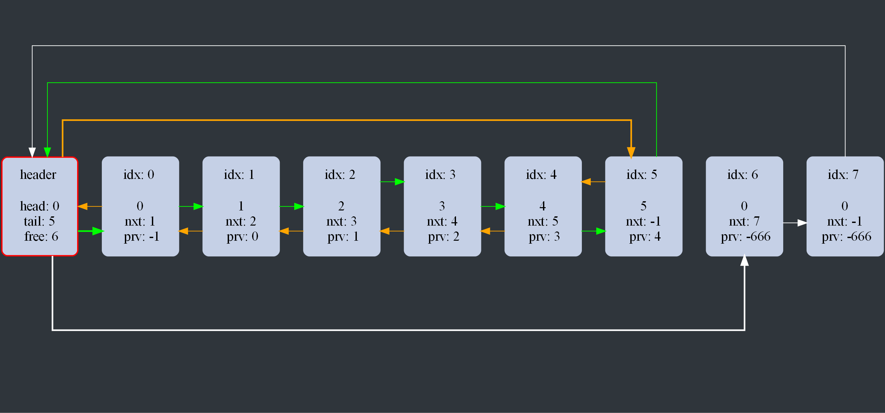 

dpi = 20:

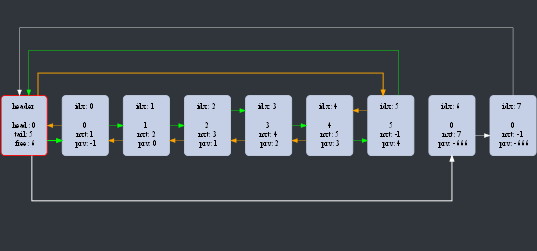 

Example of code:

	digraph G
	{
	    graph [dpi = 20];

	    example_node1[label = "Hello, World!"];
	    example_node2[label = "Yet Another 'Hello, World!'"];

	    example_node1 -> example_node2 [color = "red"]
	}

___
### ***Ranks*** 
Same rank of nodes means that nodes are on the same line.

*In GraphVIZ system of ranks is a stable way to layout nodes in one line.*

**`rank`** --- attribute to set rank of node(s)
(Valid values:  `same` (set nodes on the same rank), `min` (set nodes on the minimal rank), `max` (set nodes on the maximal rank)).

**`ranksep`** --- attribute to set distance between ranks (inches)

Example of code:

	
	digraph G
	{
		graph [dpi = 100];
	    
		{rank = min;
			above_other_nodes[label = "I'm high"];
		}
		
		{rank = same;
			example_node1[label = "Hello, World!"];
			example_node2[label = "Yet Another 'Hello, World!'"];
			example_node3[label = "And Another 'Hello, World!'?!"];
			example_node4[label = "Not 'Hello, World!'"];
		}
	    
		{rank = max;
			below_other_nodes[label = "I'm low, u know"];
		}
		
		example_node2 -> below_other_nodes [color = "green"];
			
		example_node1 -> example_node2 -> example_node4 [color = "red"];
		example_node1 -> example_node3 [color = "red"];
		example_node2 -> example_node3 [color = "red"];
		
		example_node2 -> above_other_nodes [color = "blue"];
	
	}

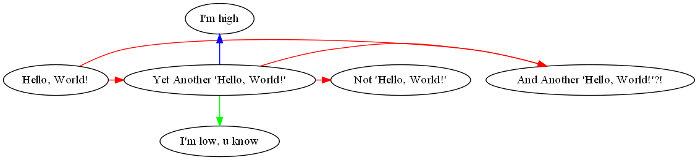

Adding `ranksep = 1.5`:

	digraph G
	{
		graph [dpi = 100];
	    
		ranksep = 1.5;
	    
		{rank = min;
			above_other_nodes[label = "I'm high"];
		}
		
		{rank = same;
			example_node1[label = "Hello, World!"];
			example_node2[label = "Yet Another 'Hello, World!'"];
			example_node3[label = "And Another 'Hello, World!'?!"];
			example_node4[label = "Not 'Hello, World!'"];
		}
	    
		{rank = max;
			below_other_nodes[label = "I'm low, u know"];
		}
		
		example_node2 -> below_other_nodes [color = "green"];
			
		example_node1 -> example_node2 -> example_node4 [color = "red"];
		example_node1 -> example_node3 [color = "red"];
		example_node2 -> example_node3 [color = "red"];
		
		example_node2 -> above_other_nodes [color = "blue"];
	
	}

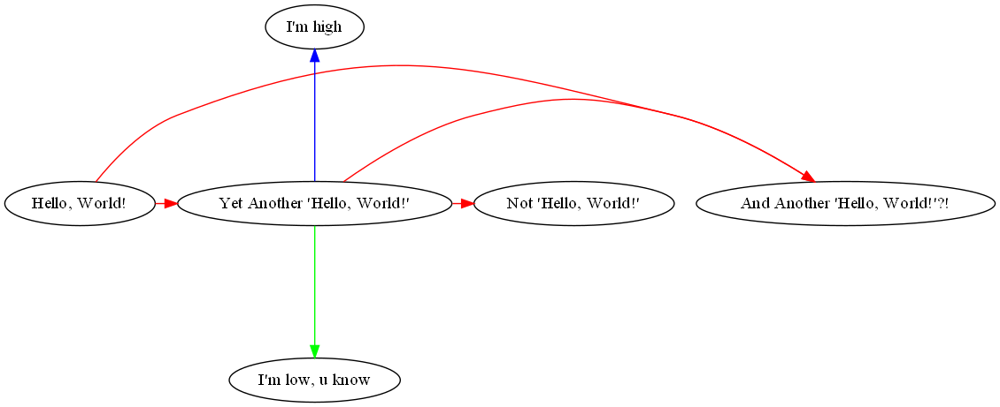

___
### ***Splines***
The standard style of edges in GraphVIZ is very hard to control, but you can use **`splines`** attribute to change it. Tips given below are working nice with **`splines = ortho`**.

Default splines (without `splines` attribute)

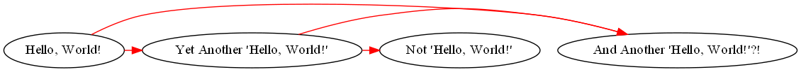

`splines = ortho`:

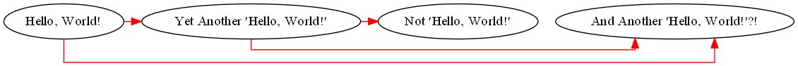

Example of code:

	
	
	digraph G
	{
    	graph [dpi = 100];
		splines = ortho
		
		{rank = same;
			example_node1[label = "Hello, World!"];
			example_node2[label = "Yet Another 'Hello, World!'"];
			example_node3[label = "And Another 'Hello, World!'?!"];
			example_node4[label = "Not 'Hello, World!'"];
   	 	}
    
		example_node1 -> example_node2 -> example_node4 [color = "red"];
    	example_node1 -> example_node3 [color = "red"];
    	example_node2 -> example_node3 [color = "red"];
	}
___
### ***Edge attributes***
**`minlen`** --- minimal length of edge (inches)

**`penwidth`** --- width of edge (pixels)

**`weight`** --- edge priority (attribute adds 'weight' to arrow, so GraphVIZ will try to make it as short as possible)

**`dir`** --- edge direction

### ***Node attributes***
*Note that if you want to set two same attributes you should write both of them in `""` (Example: `style = "rounded, filled"`)*

**`shape`** --- shape of node

**`style`** --- style of node (recommended value: roun**ded**)

**`height`, `width`** --- maximal height and width of node in inches (**use with 
`fixedsize = true` to set fixed size of node**)

**`penwidth`** --- width of node border

Example of code:

	digraph G
	{
    	graph [dpi = 100];
		splines = ortho
		
		bgcolor = "#2F353B"
		
		edge[minlen = 3, penwidth = 3; color = "green"];
		node[shape = "rectangle", style = "rounded, filled",
			height = 3, width = 2.3, fixedsize = true,
			fillcolor = "#00b899",
			fontsize = 30,
			penwidth = 5, color = "yellow"
			]
		
		{rank = same;
			example_node1[label = "HW!"];
			example_node2[label = "YAHW"];
			example_node3[label = "AAHW?!"];
			example_node4[label = "NHW"];
   	 	}
    
		example_node1 -> example_node2 -> example_node4 [color = "red"];
    	example_node1 -> example_node3 [color = "red"];
    	example_node2 -> example_node3 [color = "red"];
	}

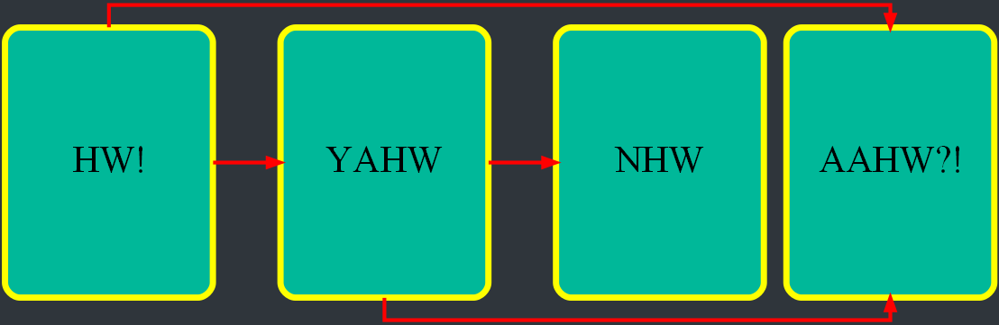

___
___
## Tips
### ***Powerful*** `style = invis`
It's very powerful architechture tool to create nice graphs. Can be used for edges and nodes. Examples of usage below.
___
### ***Ordered layout***
To create ordered layout you can use edge's attribute `weight` and `style = invis` to create 'heavy' invisible edges. They bind nodes in needed order.

Example of code:

	digraph G
	{
    	graph [dpi = 100];
		splines = ortho
				
		edge[minlen = 3, penwidth = 3];
		node[shape = rectangle, style = rounded, fixedsize = true,
		height = 3, width = 2, fontsize = 30];
		
		{rank = same;
		node1[label = "1"];
		node2[label = "2"];
		node3[label = "3"];
		node4[label = "4"];
		node5[label = "5"];
		node6[label = "6"];
		node7[label = "7"];
		}
	
		node1 -> node7 [color = "green"];
		node3 -> node1 [color = "green"];
		node2 -> node6 [color = "green"];
		node3 -> node6 [color = "green"];
		node4 -> node2 [color = "green"];		
	}

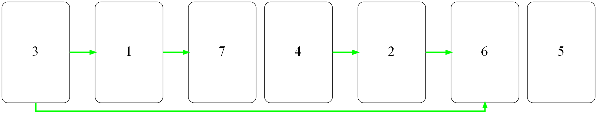

Add 'heavy' arrows:

	...

		node1 -> node2 -> node3 -> node4 [weight = 5];
		node4 -> node5 [weight = 5];
		node5 -> node6 [weight = 5];
		node6 -> node7 [weight = 5];
	...

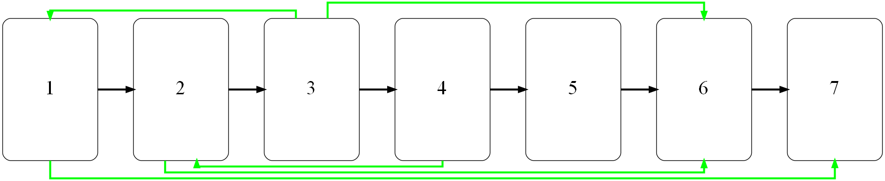

Add `style = invis`

	...

		node1 -> node2 -> node3 -> node4 [weight = 5, style = invis];
		node4 -> node5 [weight = 5, style = invis];
		node5 -> node6 [weight = 5, style = invis];
		node6 -> node7 [weight = 5, style = invis];
	...

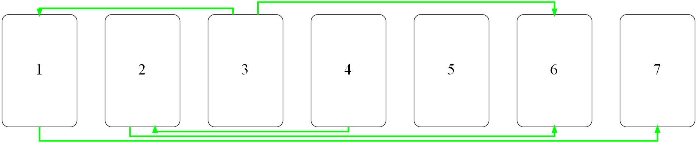

___
### ***Horizontal layout***
We can use graph's attribute `rankdir` to set horizontal layout, but this layout isn't stable when you create edges.

	digraph G
	{
    	graph [dpi = 100];
		
		edge[minlen = 3, penwidth = 3];
		node[shape = rectangle, style = rounded, fixedsize = true,
		height = 3, width = 2, fontsize = 30];
		
		node1[label = "1"];
		node2[label = "2"];
		node3[label = "3"];
		
		node1 -> node2 -> node3;
	}

Default layout:

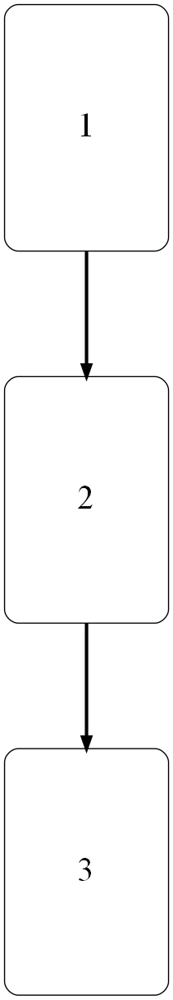

With `rankdir = LR;`:

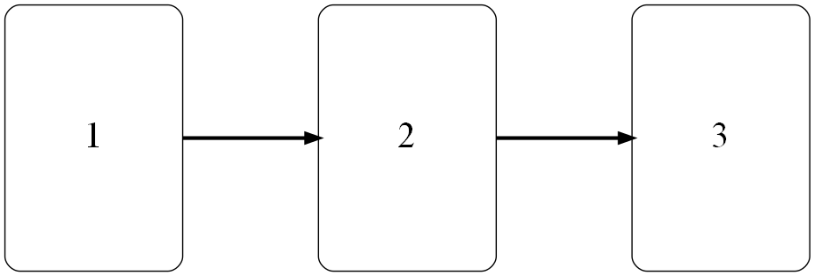

Add `node1 -> node3`:

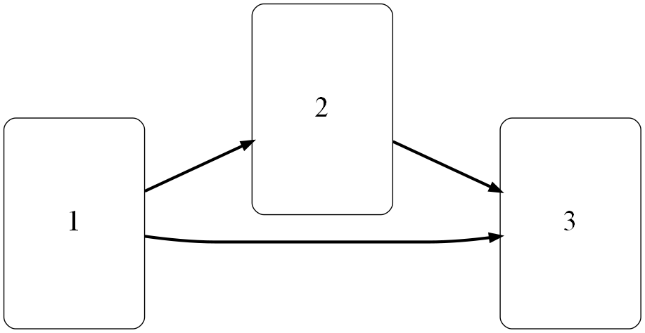

but you can use `weight` attribute (see ***Ordered layout***) to fix nodes positions.

Another way is to use `rank = same` for nodes (see ***Ranks***), which explicitly says that nodes should have the same rank on the picture. This variant is stable, so recommended.
___
### ***shape*** `record`
`rank = same` is broken for node's attribute `shape = record`, which is very suitable for dump information. The problem appears if you try to create edges between adjacent nodes. There are two solutions:
1. Not to use `record`'s as buggy shape.
2. Use `splines = ortho` with records.
___
### ***How to set distance between edges***
There is *no* way to set distance explicitly. So we have to use a trick.

We create two nodes (let's call them base nodes) with `style = invis` on `rank = min` and `rank = max`, then create *our* nodes on `rank = same` and connect our first node to each of base nodes. We set graph attribute `ranksep = 1.5`. That way we explicitly create space above and below *our* nodes and GraphVIZ won't squeeze picture vertically.

Without a trick:

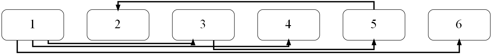

With a visible trick:

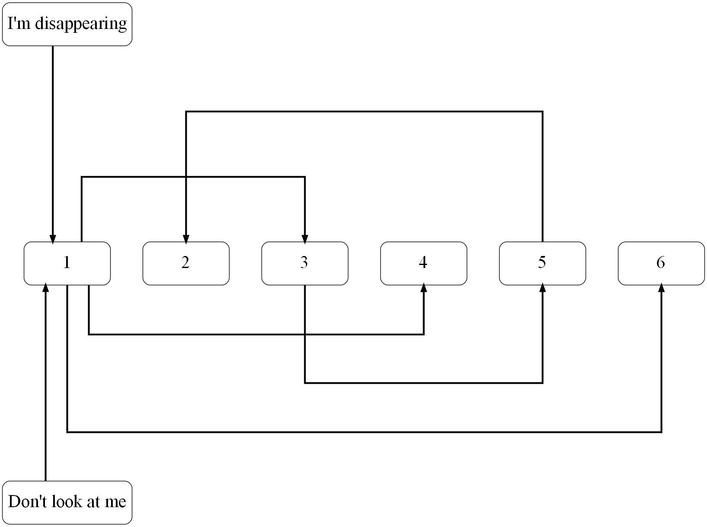

With an invisible trick:

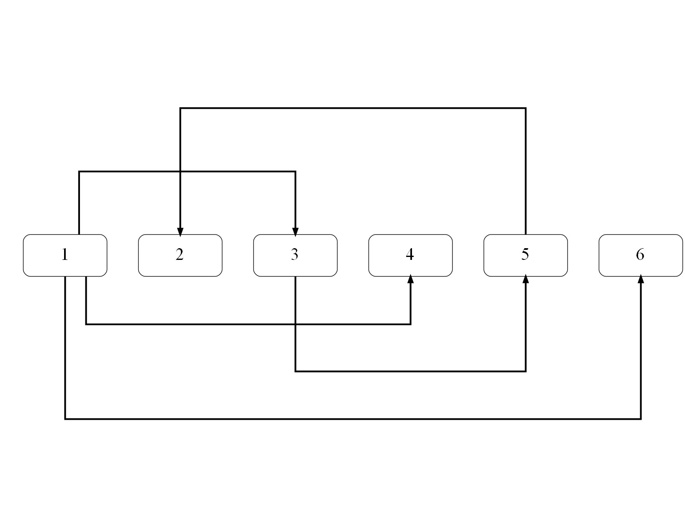

Example of code (see and *understand* ***Ranks*** to create invisible trick):

	digraph G
	{
    	graph [dpi = 100];
		
		ranksep = 1.5;
		
		splines = ortho

		edge[minlen = 3, penwidth = 3];
		node[shape = record, style = rounded,
		 	 fixedsize = true, height = 1, width = 2,
		 	 fontsize = 30];
		 	 
		{rank = min;
			above_node[label = "I'm disappearing", width = 3];
		}
		{rank = same;
		node1[label = "1"];
		node2[label = "2"];
		node3[label = "3"];
		node4[label = "4"];
		node5[label = "5"];
		node6[label = "6"];
		}
		{rank = max;
			below_node[label = "Don't look at me", width = 3];
		}
		
		above_node -> node1;
		below_node -> node1;
		
		node1 -> node2 -> node3 [weight = 5; style = invis];
		node3 -> node4 -> node5 [weight = 5; style = invis];
		node5 -> node6 [weight = 5, style = invis];
		
		node1 -> node3;
		node5 -> node2;
		node1 -> node6;
		node1 -> node4;
		node3 -> node5;
	}
